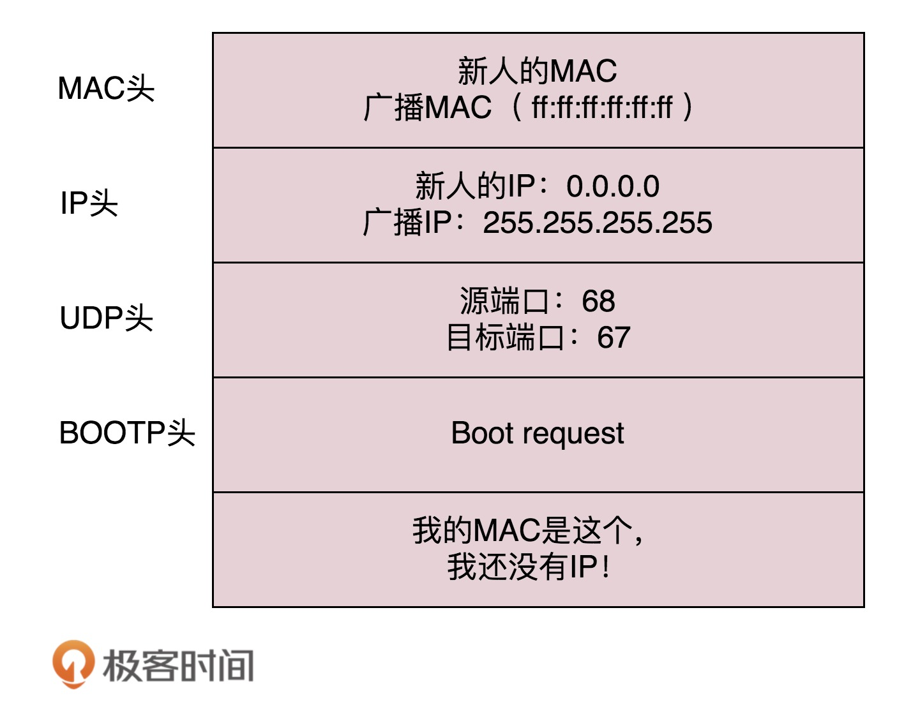
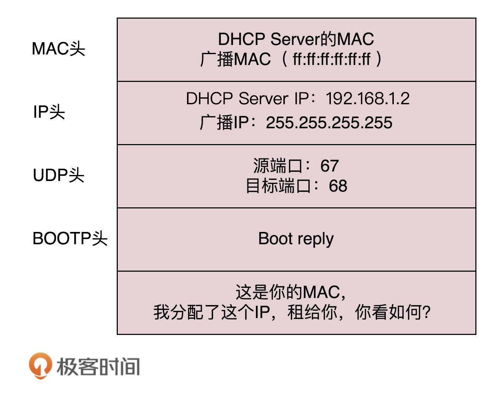
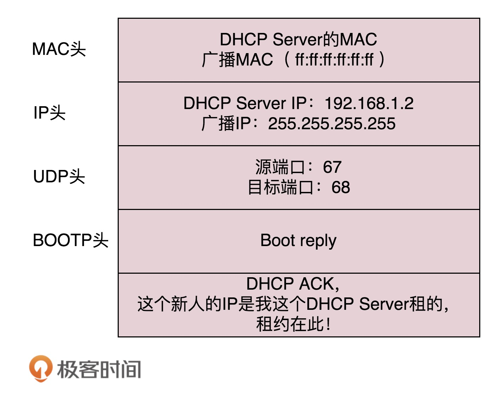

# 如何配置IP地址？
&emsp;&emsp;使用ifconfig或者ip addr都可以设置网卡的IP地址：  
```
$ sudo ifconfig eth1 10.0.0.1/24
$ sudo ifconfig eth1 up
```  
```
$ sudo ip addr add 10.0.0.1/24 dev eth1
$ sudo ip link set up eth1
```  
&emsp;&emsp;但是，这个IP地址不是随便配置成什么都可以的。当需要手动配置一台机器的IP地址时，需要去问问网络管理员，让他给分配一段正确的IP地址。需要配置CIDR、子网掩码、广播地址和网关地址。  

# 动态主机配置协议DHCP
&emsp;&emsp;当有大量机器时，手动配置IP地址是不现实的。因此，需要有一个自动配置的协议，就是**动态主机配置协议（Dynamic Host Configuration Protocol，DHCP）**。  
&emsp;&emsp;有了DHCP协议，网络管理员只需要配置一段共享的IP地址，每一台新接入的机器都通过DHCP协议，来这个共享的IP地址段里申请，然后自动配置即可。等用完了可以还回去，其他机器也能用。  

# DHCP工作方式
**DHCP Discover**  
&emsp;&emsp;新加入的机器使用IP地址0.0.0.0发送一个广播包，目的IP为255.255.255.255。广播包封装了UDP，UDP封装了BOOTP。DHCP是BOOTP的增强版，如果去抓包，会看到协议名称还是BOOTP。包格式如下：  
  
  
**DHCP Offer**  
&emsp;&emsp;网络里面会配置**DHCP Server**，它收到上面这个数据包，发现这个MAC地址是一个新的MAC地址，就会给它分配一个IP地址，DHCP Server会为这台机器包留它提供的IP地址，从而不会为其他DHCP客户分配此IP地址。DHCP Offer格式如下：  
  
&emsp;&emsp;DHCP Server仍然使用广播地址作为目的地址，因为，此时请求分配IP的新机器还没有自己的IP。服务器会把子网掩码、网关、分配的IP地址、租用期都发送给新机器。  
  
**选择阶段**  
&emsp;&emsp;新机器会收到上面这个回复，如果有多个DHCP Server，这台新机器会收到多个IP地址，它会选择其中一个DHCP Offer，一般是最先到达的那个，并且会向网络发送一个DHCP Request广播数据包，包含客户端的MAC地址、接受的租约中的IP地址、提供此租约的DHCP服务器地址。它会告诉所有DHCP Server它将接受哪一台服务器提供的IP地址。数据格式如下：  
  
&emsp;&emsp;由于还没有得到DHCP Server的最后确认，因此客户端仍然使用0.0.0.0为源IP，255.255.255.255为目标IP进行广播。  
  
**确认阶段**  
&emsp;&emsp;当DHCP Server收到客户端的DHCP Request后，会广播给客户机一个DHCP ACK消息包，表明已经接受客户机的选择，并将这一IP地址的合法租用信息和其他配置信息都放入该广播包，发送给客户端。数据包格式如下：  
  

# IP地址的收回和租约
&emsp;&emsp;客户端会在租期过去50%的时候，直接向为其提供IP地址和DHCP Server发送DHCP Request消息包。客户机在收到该服务器回复的DHCP ACK消息包后，会根据包中提供的新的租期以及其他已经更新的TCP/IP参数，更新自己的配置。这样，IP组用更新就完成了。  
