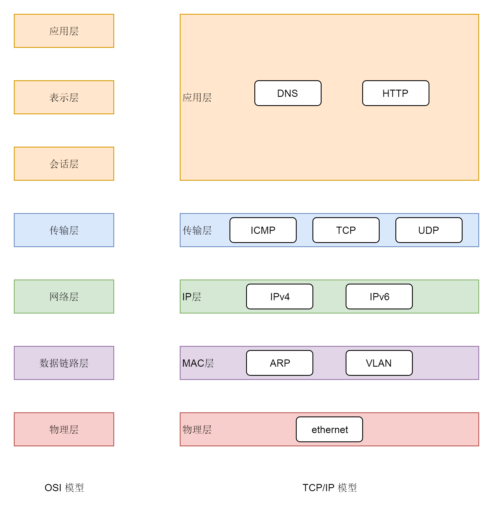

&emsp;&emsp;**OSI七层模型**和**TCP/IP模型**：  
  
&emsp;&emsp;二层到四层都是在Linux内核里处理的，到应用层就需要区分网络包发给哪个应用。在传输层的TCP和UDP协议里，都有端口的概念，不同应用监听不同端口。  
&emsp;&emsp;应用层和内核互通的机制，就是通过Socket系统调用。Socket属于操作系统的概念，而非网络协议分层的概念，它哪一层都不属于。操作系统对于网络协议的实现模式是，二层到四层的处理代码在内核里面，应用层的处理代码让应用自己去做，两者需要跨内核态和用户态通信，因此需要系统调用来完成，也就是Socket。  

# Socket通信
&emsp;&emsp;Socket接口大多数情况下操作的是传输层，更底层的协议不需要它来操心，这也是分层的好处。  
&emsp;&emsp;传输层有两个主流协议TCP和UDP，因此，socket编程也是主要操作这两个协议。  
&emsp;&emsp;TCP和UDP的区别：
1. TCP是面向连接的，UDP是面向无连接的。
2. TCP提供可靠交付，无差错、不丢失、不重复、并且按序到达；UDP不提供可靠交付，不保证不丢失，不保证按顺序到达。
3. TCP是面向字节流的，发送时发的是一个流，没头没尾；UDP是面向数据报的，一个一个发送。
4. TCP提供流量控制和拥塞控制，既防止被对端压垮，也防止网络被压垮。

&emsp;&emsp;无论用socket操作TCP，还是UDP，首先都要调用socket函数：  
```
int socket(int domain, int type, int protocol);
```  
&emsp;&emsp;socket函数用于创建一个socket的文件描述符，唯一标识一个socket。函数有三个参数：
* domain：表示使用什么IP层协议。AF_INET表示IPv4，AF_INET6表示IPv6。
* type：表示socket类型。SOCK_STREAM即TCP，SOCK_DGRAM即UDP，SOCK_RAW可以直接操作IP层，或者非TCP和UDP的协议，例如ICMP。
* protocol：协议，包括IPPROTO_TCP、IPPROTO_UDP。

&emsp;&emsp;通信结束后，要像关闭文件一样，关闭socket。  

## TCP
  
&emsp;&emsp;TCP服务端要先调用bind函数，给这个socket赋予一个端口和IP地址：  
```
int bind(int sockfd, const struct sockaddr *addr,socklen_t addrlen);

struct sockaddr_in {
  __kernel_sa_family_t  sin_family;  /* Address family    */
  __be16    sin_port;  /* Port number      */
  struct in_addr  sin_addr;  /* Internet address    */

  /* Pad to size of `struct sockaddr'. */
  unsigned char    __pad[__SOCK_SIZE__ - sizeof(short int) -
      sizeof(unsigned short int) - sizeof(struct in_addr)];
};

struct in_addr {
  __be32  s_addr;
};
```  
&emsp;&emsp;sockfd是上面创建的socket文件描述符。在sockaddr_in结构中，sin_family设置为AF_INET，表示IPv4；sin_port是端口号；sin_addr是IP地址。  
&emsp;&emsp;服务端应用所在的服务器可能有多个网址、多个地址，可以选择监听在一个地址，也可以监听0.0.0.0表示所有的地址都监听。客户端要访问服务端，需要先知道其端口。客户端不需要bind，因为客户端随便分配一个端口即可。  
&emsp;&emsp;接下来，服务端要调用listen进入LISTEN状态，等待客户端进行连接：  
```
int listen(int sockfd, int backlog);
```  
  
&emsp;&emsp;客户端调用connect函数发起连接：  
```
int connect(int sockfd, const struct sockaddr *addr, socklen_t addrlen);
```  
&emsp;&emsp;在参数中指明要连接的IP地址和端口号，然后发起三次握手。内核会给客户端分配一个临时的端口。一旦握手成功，服务端的accept就会返回另一个socket。  
  
&emsp;&emsp;服务端调用accept，等待内核完成了至少一个连接的建立，才返回。如果没有一个连接完成了三次握手，accept就一直等待；如果有多个客户端发起连接，并且在内核里完成了多个三次握手，建立了多个连接，这些连接会被放到一个队列里面。accept会从队列里取出一个进行处理：  
```
int accept(int sockfd, struct sockaddr *addr, socklen_t *addrlen);
```  
  
&emsp;&emsp;监听socket和真正用来传送数据的socket，是两个socket，一个叫作**监听socket**，一个叫作**已连接socket**。成功建立连接后，双方开始通过read和write来读写数据，就像往一个文件流里写东西一样。  
  
&emsp;&emsp;TCP协议的socket调用过程：  
1. 服务端和客户端都调用socket，得到文件描述符；
2. 服务端调用listen，进行监听。
3. 服务端调用accept，等待客户端连接。
4. 客户端调用connect，连接服务端。
5. 服务端accept返回用于传输的socket的文件描述符。
6. 客户端调用write写入数据。
7. 服务端调用read读取数据。


## UDP
  
&emsp;&emsp;UDP是没有连接的，所以不需要三次握手，也不需要调用listen和connect，但是UDP的交互仍然需要IP地址和端口号，因此也需要bind。  
&emsp;&emsp;对于UDP来讲，没有所谓的连接维护，也没有所谓的连接的发起方和接收方，也不存在客户端和服务端的概念，大家都是客户端，同时也是服务端。只要有一个socket，多台机器就可以任意通信。因此，每个UDP的socket都需要bind。每次通信时，调用sendto和revcfrom，都要传入IP地址和端口号：  
```
ssize_t sendto(int sockfd, const void *buf, size_t len, int flags, const struct sockaddr *dest_addr, socklen_t addrlen);

ssize_t recvfrom(int sockfd, void *buf, size_t len, int flags, struct sockaddr *src_addr, socklen_t *addrlen);
```  
  