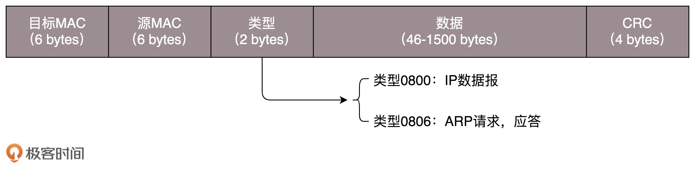
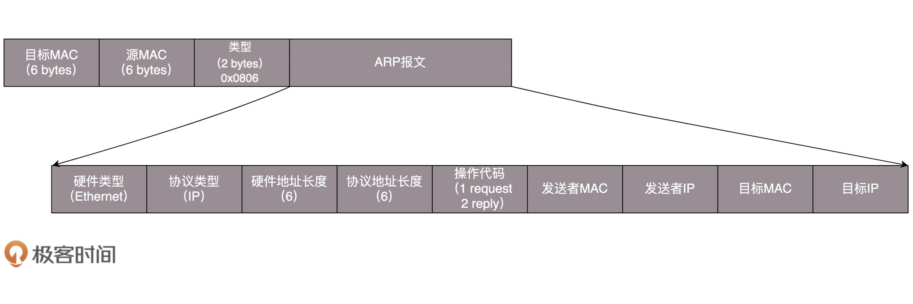

# 从物理层到数据链路层
## 第一层（物理层）
&emsp;&emsp;要让两台电脑通信，最简单的方法就是用一根网线把两台电脑连起来。  
&emsp;&emsp;普通网线的水晶头要做交叉线，用的就是**1-3、2-6交叉接法**。水晶头的第1、2和第3、6脚，分别起着收、发信号的作用，这就能够在物理层实现一端发送的信号，另一端能收到。  
&emsp;&emsp;除了用网线连接这两台电脑，还需要配置这两台电脑的IP地址、子网掩码和默认网关。到此为止，两台电脑已经构成了一个最小的局域网LAN。  
&emsp;&emsp;如果要把三台电脑连起来呢？可以使用**集线器Hub**，这种设备有多个口，可以将多台电脑连接起来，但是，和交换机不同，集线器没有大脑，它是完全工作在物理层的，**它会把自己收到的每个数据包，都复制到其他端口上去，这就是第一层物理层的工作方式**。  

## 第二层（数据链路层）
&emsp;&emsp;Hub采取的是广播模式，每一台电脑发出的包，所有其他电脑都可以收到，这就会导致如下几个问题：  
1. 这个包是发给谁的？谁应该接收？
2. 大家都在发，会不会产生混乱？
3. 如果发送时出现错误，怎么办？

&emsp;&emsp;这几个问题，就是第二层，数据链路层要解决的问题。  
&emsp;&emsp;**MAC**全称为**Media Access Control**，即**媒体访问控制**。其实就是控制往媒体上发数据的时候，谁先发、谁后发的问题，防止发生混乱，这个解决的就是第二个问题，这个问题中的规则，叫做**多路访问**。  
  
&emsp;&emsp;多路访问有下面三种方式：  
* 方式一：**信道划分**。分为多个信道，你走你的，我走我的，互不干扰。
* 方式二：**轮流协议**。轮着来。
* 方式三：**随机接入协议**。不管三七二十一，有事儿先出门，发现特别堵，就回去，错过高峰再出。以太网使用的就是这个方式。  

&emsp;&emsp;第一个问题：发给谁，谁接收？就需要用到MAC地址。这就涉及到了第二层的网络包格式：  
  
&emsp;&emsp;有了目标MAC地址，数据包在链路层上传播，某个网卡才能发现这个包是给它的。  
  
&emsp;&emsp;对于以太网，第二层的后面是**循环冗余检测CRC**，计算整个包在发送过程中是否出现了错误，主要解决第三个问题。  
  
&emsp;&emsp;当知道目标机器的IP地址时，如何获取其MAC地址？通过**ARP协议**，发送一个广播包，谁是这个IP谁来回答：  
  
&emsp;&emsp;为了避免每次都用ARP请求，机器本地也会进行ARP缓存。机器会不断上线下线，IP可能会变，所以ARP的MAC地址缓存过一段时间就会过期。  

## 局域网
&emsp;&emsp;多台电脑用Hub连接起来后就可以进行通信了。但是一旦机器数目增多，就会出现很多问题，因为Hub是广播的，不管某个接口是否需要，都会发送出去，然后让主机来判断是不是需要。由于每个口只连接一台电脑，这台电脑又不怎么换IP和MAC地址，因此只要记住这台电脑的MAC地址，如果目标MAC不是这台电脑的，这个口就不用转发了。  
&emsp;&emsp;这就是二层设备**交换机**的功能。交换机如何知道每个口对应的电脑的MAC地址呢？通过自学习。交换机通过自学习会形成一个**转发表**，由于每个机器的IP地址会变，所在的口也会变，因此转发表也是有过期时间的。  

# 交换机与VLAN
