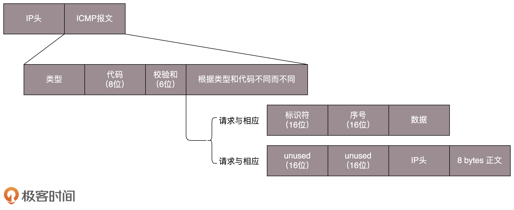
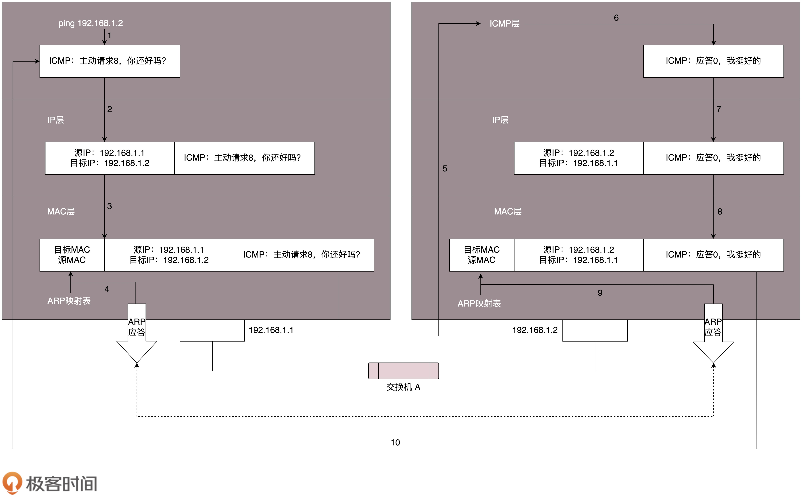
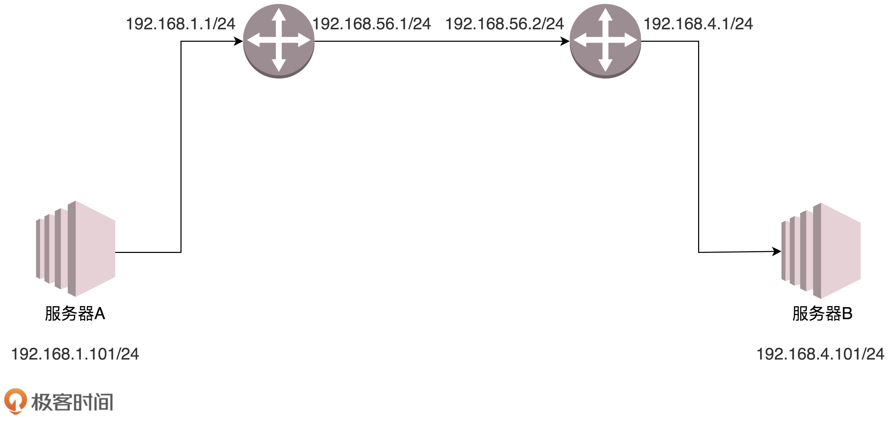
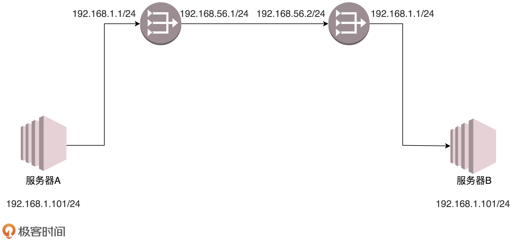

# 从物理层到数据链路层
## 第一层（物理层）
&emsp;&emsp;要让两台电脑通信，最简单的方法就是用一根网线把两台电脑连起来。  
&emsp;&emsp;普通网线的水晶头要做交叉线，用的就是**1-3、2-6交叉接法**。水晶头的第1、2和第3、6脚，分别起着收、发信号的作用，这就能够在物理层实现一端发送的信号，另一端能收到。  
&emsp;&emsp;除了用网线连接这两台电脑，还需要配置这两台电脑的IP地址、子网掩码和默认网关。到此为止，两台电脑已经构成了一个最小的局域网LAN。  
&emsp;&emsp;如果要把三台电脑连起来呢？可以使用**集线器Hub**，这种设备有多个口，可以将多台电脑连接起来，但是，和交换机不同，集线器没有大脑，它是完全工作在物理层的，**它会把自己收到的每个数据包，都复制到其他端口上去，这就是第一层物理层的工作方式**。  

## 第二层（数据链路层）
&emsp;&emsp;Hub采取的是广播模式，每一台电脑发出的包，所有其他电脑都可以收到，这就会导致如下几个问题：  
1. 这个包是发给谁的？谁应该接收？
2. 大家都在发，会不会产生混乱？
3. 如果发送时出现错误，怎么办？

&emsp;&emsp;这几个问题，就是第二层，数据链路层要解决的问题。  
&emsp;&emsp;**MAC**全称为**Media Access Control**，即**媒体访问控制**。其实就是控制往媒体上发数据的时候，谁先发、谁后发的问题，防止发生混乱，这个解决的就是第二个问题，这个问题中的规则，叫做**多路访问**。  
  
&emsp;&emsp;多路访问有下面三种方式：  
* 方式一：**信道划分**。分为多个信道，你走你的，我走我的，互不干扰。
* 方式二：**轮流协议**。轮着来。
* 方式三：**随机接入协议**。不管三七二十一，有事儿先出门，发现特别堵，就回去，错过高峰再出。以太网使用的就是这个方式。  

&emsp;&emsp;第一个问题：发给谁，谁接收？就需要用到MAC地址。这就涉及到了第二层的网络包格式：  
  
&emsp;&emsp;有了目标MAC地址，数据包在链路层上传播，某个网卡才能发现这个包是给它的。  
  
&emsp;&emsp;对于以太网，第二层的后面是**循环冗余检测CRC**，计算整个包在发送过程中是否出现了错误，主要解决第三个问题。  
  
&emsp;&emsp;当知道目标机器的IP地址时，如何获取其MAC地址？通过**ARP协议**，发送一个广播包，谁是这个IP谁来回答：  
  
&emsp;&emsp;为了避免每次都用ARP请求，机器本地也会进行ARP缓存。机器会不断上线下线，IP可能会变，所以ARP的MAC地址缓存过一段时间就会过期。  

## 局域网
&emsp;&emsp;多台电脑用Hub连接起来后就可以进行通信了。但是一旦机器数目增多，就会出现很多问题，因为Hub是广播的，不管某个接口是否需要，都会发送出去，然后让主机来判断是不是需要。由于每个口只连接一台电脑，这台电脑又不怎么换IP和MAC地址，因此只要记住这台电脑的MAC地址，如果目标MAC不是这台电脑的，这个口就不用转发了。  
&emsp;&emsp;这就是二层设备**交换机**的功能。交换机如何知道每个口对应的电脑的MAC地址呢？通过自学习。交换机通过自学习会形成一个**转发表**，由于每个机器的IP地址会变，所在的口也会变，因此转发表也是有过期时间的。  

# 交换机与VLAN

# ICMP与ping
## ICMP协议格式
&emsp;&emsp;ping是基于ICMP协议的，ICMP全称**Internet Control Message Protocol**，即**互联网控制报文协议**。网络包在复杂的网络环境中传输，会遇到各种各样的问题，当遇到问题的收，需要传出消息来，报告情况，这样才能调整传输策略。  
&emsp;&emsp;ICMP报文是封装在IP包里面的：  
  
&emsp;&emsp;ICMP报文有很多类型，不同类型有不同的代码。最常用的类型是**主动请求为8，主动请求的应答为0**。

## 查询报文类型
&emsp;&emsp;常用的ping就是查询报文，是一种主动请求，并且获得主动应答的ICMP协议。
## 差错报文类型
&emsp;&emsp;差错报文类型是数据包传送过程中出现错误后发出的消息，它不是主动请求的回复。其中：**终点不可达为3，源抑制为4，超时为11，重定向为5**。  
&emsp;&emsp;**终点不可达**包括很多情况，具体的原因在代码中表示，网络不可达为0，主机不可达为1，协议不可达为2，端口不可达为3，需要进行分片但设置了不分片为4。  
&emsp;&emsp;**源抑制**就是让源站放慢发送速度。  
&emsp;&emsp;**超时**就是超过网络包的生存时间还是没到。  
&emsp;&emsp;**路由重定向**就是让下次发给另一个路由器。  

## ping：查询报文类型的使用
&emsp;&emsp;ping的发送和接收过程如下：  
  
&emsp;&emsp;假设主机A的IP地址是192.168.1.1，主机B的IP地址是192.168.1.2，当在主机A上ping主机B的IP地址。  
&emsp;&emsp;源主机会构建一个ICMP请求包，里面包含很多字段。最重要的有两个，第一个是**类型字段**，对于这个请求包而言是8；另一个字段是**顺序号**，用来区分连续ping的时候发出的多个数据包，每发出一个请求数据包，顺序号会自动加1。为了能够计算往返时间RTT，会在报文的数据部分插入发送时间。  
&emsp;&emsp;ICMP协议会将数据包交给IP层，IP层会把目的地址192.168.1.2作为目的地址，本机IP作为源地址，封装成一个IP数据包。接下来，需要加上MAC头，如果本机的ARP缓存中有目的IP对应的MAC地址，则可以直接使用；如果没有，则需要发送ARP协议获取MAC地址，获取到后，就可以构建一个链路层帧。然后将它发送给主机B。  
&emsp;&emsp;主机B收到之后，将IP数据包从帧中提取出来，交给本机的IP层，IP层检查后，将有用的信息提取后交给ICMP协议。然后会构建一个ICMP应答包，类型字段是0，顺序号为接收到的请求包中的顺序号。  
&emsp;&emsp;在规定时间内，如果源主机没有收到ICMP应答包，则说明目标主机不可达；如果接收到了ICMP应答包，则说明目标主机可达，此时，源主机会检查，用当前时刻减去该数据包最初从源主机上发出的时刻，就是ICMP数据包的延迟时间。  
  
&emsp;&emsp;如果不在控制范围内，很多中间设备都是禁止ping的，但是ping不通不代表网络不通，此时要使用telnet，通过其他协议来测试网络是否通。  

## Traceroute：差错报文类型的使用
&emsp;&emsp;Traceroute命令会使用ICMP规则，故意制造一些能够产生错误的场景。  
&emsp;&emsp;Traceroute的第一个作用就是故意设置特殊的TTL，来追踪去往目的地时沿途经过的路由器。Traceroute的参数指向某个目的IP，它会发送一个UDP数据包，将TTL设置为1，也就是一旦遇到一个路由器它就牺牲了，于是，就会返回一个ICMP包，类型是时间超时。接下来，将TTL设置为2，让它在第二关牺牲。如此反复，直到到达目的主机，这样，Traceroute就拿到了所有的路由器IP了。  
&emsp;&emsp;Traceroute还有一个作用是故意不设置分片，从而确定路径的MTU。要做的工作是发送分组，并设置不分片标志。发送的第一个分组的长度正好与出口 MTU 相等。如果中间遇到窄的关口会被卡住，会发送 ICMP 网络差错包，类型为“需要进行分片但设置了不分片位”。其实，这是人家故意的好吧，每次收到 ICMP“不能分片”差错时就减小分组的长度，直到到达目标主机。  

# 网关
&emsp;&emsp;几台电脑通过交换机连接可以组成一个局域网，但是要想访问外网，必须要有一个路由器，路由器有内网网口和外网网口，把外网网口配置成和外网网段的IP地址在一个网段，内网网口配置成和局域网在同一个网段。  
&emsp;&emsp;当给局域网内部每台机器的网卡时，除了配置IP地址，还需要配置**网关**。  

## MAC头和IP头的细节
  
&emsp;&emsp;在任何一台机器上，当要访问另一个IP地址的时候，都会先判断，这个目标IP地址，和当前机器的IP地址，是否在同一个网段，通过CIDR和子网掩码来判断是否在同一个网段。  
&emsp;&emsp;**如果是同一个网段**，那就没网关什么事了，直接将源地址和目标地址放入IP头中，然后通过ARP获得MAC地址，将源MAC和目的MAC放入MAC头，发出去即可。  
&emsp;&emsp;**如果不是同一个网段**，就需要发往默认网关Gateway，Gateway的地址跟源IP在同一个网段。例如，192.168.1.0/24这个网段，Gateway往往会是192.168.1.1/24或者192.168.1.2/24。由于网关跟源IP在同一个网段，因此就跟发往局域网内其他机器一样：将源IP和目标IP放入IP头，通过ARP获得网关的MAC地址，将源MAC和目标MAC放入MAC头发出去，网关所在的端口会把网络包收进来，接下来怎么做，就完全看网关了。  
  
&emsp;&emsp;**网关往往是一个路由器，是一个三层设备**。三层设备会把MAC头和IP头都取下来，然后根据里面的内容，决定接下来把包转发到哪里。  
&emsp;&emsp;把网关叫做路由器其实是不准确的，路由器一般有多个网口或者网卡，分别连着多个局域网，每个口的IP地址和它所连接的局域网的IP地址在同一个网段，每个口都是那个局域网的网关。任何一个想发往其他局域网的包，都会到达路由器的一个网口，然后路由器会拿下MAC头和IP头，根据自己的路由表，选择一个发出的网口，再加上IP头和MAC头，把数据包从所选择网口发送出去。  

## IP头和MAC头哪些变、哪些不变？
&emsp;&emsp;MAC地址是一个局域网内才有效的地址。只要过网关，MAC地址就会改变。IP地址可能变，也可能不变，不改变IP地址的网关称为**转发网关**；改变IP地址的网关，称为**NAT网关**。  
### 转发网关
  
&emsp;&emsp;A要访问B，A和B不在同一个网段，因此需要先发给网关，网关已经静态配置好了，是192.168.1.1，A首先发送ARP请求获取网关的MAC地址，然后发送包。包到达192.168.1.1这个网口，发现MAC一致，于是把包收进来，由于路由器A中配置了静态路由，要访问192.168.4.0/24，要从192.168.56.1这个口出去，下一跳为192.168.56.2。  
&emsp;&emsp;那192.168.56.2的MAC地址是什么呢？路由器A发送ARP请求获取192.168.56.2的MAC地址，然后发送包。包到达192.168.56.2这个网口，发现MAC一致，将包收进来。由于在路由器B中也配置了静态路由，要访问192.168.4.0/24，就要从192.168.4.1这个口出去，没有下一跳了，因为这个网口就是这个网段的。路由器把数据包从这个口发出去，发给192.168.4.101，那它的MAC地址是什么？仍然是通过ARP获取。最终，包到达服务器B。  
&emsp;&emsp;从这个过程可以看出，**每到一个新的局域网，MAC地址都会变，但是IP地址不会变，始终是目的主机的IP地址**。  

### NAT网关
  
&emsp;&emsp;局域网之间没有商量过，各定各的网段，因此有可能一个局域网里的一台机器的IP地址是192.168.1.101，而另一个局域网内一台机器的地址也是192.168.1.101。  
&emsp;&emsp;如何解决这个问题？各个局域网内部的地址可以自己指定，各管各的，但是每个局域网都要有一个对外的公网地址。例如目标服务器B，可以给它一个192.168.56.2，在网关路由器B上，需要记下来192.168.56.2对应192.168.1.101，凡是访问192.168.56.2，都转成192.168.1.101。  
&emsp;&emsp;A要访问B，指定的目标地址为192.168.56.2，A发现跟它不在同一个网段，因而会转发给网关，过程同上。路由器A收到之后，根据自己的路由配置，知道要访问192.168.56.2/24，要从192.168.56.1这个口出去，发给192.168.56.2，当网络包要发送到中间的局域网的时候，服务器A也要有一个公网地址，因此，源地址也不能用192.168.1.101，而需要改成192.168.56.1，因此发送的包源MAC为192.168.56.1的MAC地址，目标MAC是192.168.56.2的MAC地址，源IP是192.168.56.1，目标IP是192.168.56.2。  
&emsp;&emsp;路由器B也是NAT网关，它上面配置了，要访问的192.168.56.2对应的局域网内地址是192.168.1.101，于是改为访问192.168.1.101，根据路由器B的路由配置，发出这个包，它的源MAC是192.168.1.1的MAC地址，目标MAC是192.168.1.101的MAC地址，源IP是192.168.56.1，目标IP是192.168.1.101。包到达服务器B。  
  
&emsp;&emsp;NAT是**Network Address Translation**，网络地址转换。这种方式是很常见的，没家都有路由器，家里的网段都是192.168.1.x，肯定访问不了其他局域网的私有IP地址，当家里的包发出去的时候，都被家用路由器NAT为运营商的地址了。  
&emsp;&emsp;办公室访问外网的时候，也是被NAT过的，因为不可能办公室里的每台机器都是公网可见的，公网地址是很贵的，一般一个办公室共用一到两个出口IP地址。  
&emsp;&emsp;一个局域网内一般会有多台地址，NAT使用主机+端口映射的方式处理对应关系。  

# 路由协议
## 如何配置路由
&emsp;&emsp;路由器是一台网络设备，它有多张网卡。当一个入口的网络包送到路由器时，它会根据**路由表**进行转发。路由表中包含多条路由规则，每一条规则包含至少三条信息：  
* 目的网络：这个包想去哪个网段？
* 出口设备：要去这个网段需要从哪个口出去？
* 下一跳网关：下一跳路由器的地址。

&emsp;&emsp;通过`route`命令和`ip route`命令都可以进行查询或者配置。  
&emsp;&emsp;例如，设置`ip route add 10.176.48.0/20 via 10.173.32.1 dev eth0`，说明要去10.176.48.0/20这个网络，要从eth0端口出去，经过10.173.32.1。  
&emsp;&emsp;这种配置方式的核心思想是：**根据目的IP地址来配置路由**。  

## 如何配置策略路由
&emsp;&emsp;除了根据目的IP配置路由外，还可以根据多个参数来配置路由，称为**策略路由**。  
&emsp;&emsp;可以配置多个路由表，可以根据源IP、入口设备、TOS等选择路由表，然后在路由表中查找路由，这样可以使得来自不同来源的包走不同的路由。在一条路由规则中，也可以走多条路径：  
```
ip route add default scope global nexthop via 100.100.100.1 weight 1 nexthop via 200.200.200.1 weight 2
```  
&emsp;&emsp;下一跳有两个地方，分别是100.100.100.1和200.200.200.1，权重分别为1和2。  
&emsp;&emsp;上面说的都是静态路由，一般在网络环境简单的时候，自己配置是可以的。但是网络环境复杂多变，如果总是用静态路由，一旦网络结构发生变化，让网络管理员手工修改路由太复杂了，因而需要动态路由算法。  

## 动态路由算法
&emsp;&emsp;使用动态路由算法，可以根据路由协议生成动态路由表，随网络运行状况的变化而变化。网络拓扑结构可以抽象成图这种数据结构，这个问题就转化成**如何在图中找到最短路径**的问题。  
&emsp;&emsp;在图中求最短路径有两种方法：**Bellman-Ford算法**和**Dijkstra算法**。  
### 距离矢量路由算法
&emsp;&emsp;距离矢量路由算法是基于Bellman-Ford算法的。基本思路是，每个路由器都保存一个路由表，包含多行，每行对应网络中的一个路由器，每一行包含两部分信息，一个是要到目标路由器从哪条线出去，另一个是到目标路由器的距离。 
&emsp;&emsp;每个路由器都是知道全局信息的。这个信息如何更新？每个路由器都知道自己和邻居间的距离，每过几秒，每个路由器都将自己所知的到达所有路由器的距离告知邻居，每个路由器也能从邻居那里得到相似的信息。  
&emsp;&emsp;每个路由器根据新收集的信息，计算和其他路由器的距离。  
  
&emsp;&emsp;这个算法是有问题的，第一个问题就是好消息传得快，坏消息传得慢。如果有一个新的路由器加入这个网络，它的邻居很快发现它并广播出去，不久整个网络都知道了。但是一旦一个路由器挂了，挂的消息是没有广播的。当每个路由器发现原来的道路到不了这个路由器的时候，感觉不到它挂了，而是试图通过其他路径访问，直到试过所有路径，才发现它是真的挂了。  
&emsp;&emsp;第二个问题是，每次发送的时候，要发送整个全局路由表。网络大了，谁也受不了，最早的RIP协议就是这个算法，它适用于小型网络（小于15跳）。  
  
&emsp;&emsp;距离矢量路由算法只适用于较小的网络规模。  

### 链路状态路由算法
&emsp;&emsp;链路状态路由算法，是基于Dijkstra算法的。  
&emsp;&emsp;基本思路是：当一个路由器启动时，首先是发现邻居，向邻居发送数据包，邻居都会回复，然后计算和邻居的距离，然后将自己和邻居之间的链路状态包广播出去，发送到整个网络的每个路由器。这样每个路由器都能收到它和邻居之间的关系信息，因而，每个路由器都能在自己本地构建一个完整的图，然后针对这个图使用Dijkstra算法，找到两点之间的最短路径。  
&emsp;&emsp;链路状态算法在更新时不会发送整个路由表，只广播更新的或者改变的网络拓扑，这使得更新信息更小，节省了带宽和CPU利用率。而且一旦一个路由挂了，它的邻居都会广播这个消息，使得坏消息可以迅速收敛。  

## 动态路由协议
### 基于链路状态路由算法的OSPF
### 基于距离矢量路由算法的BGP