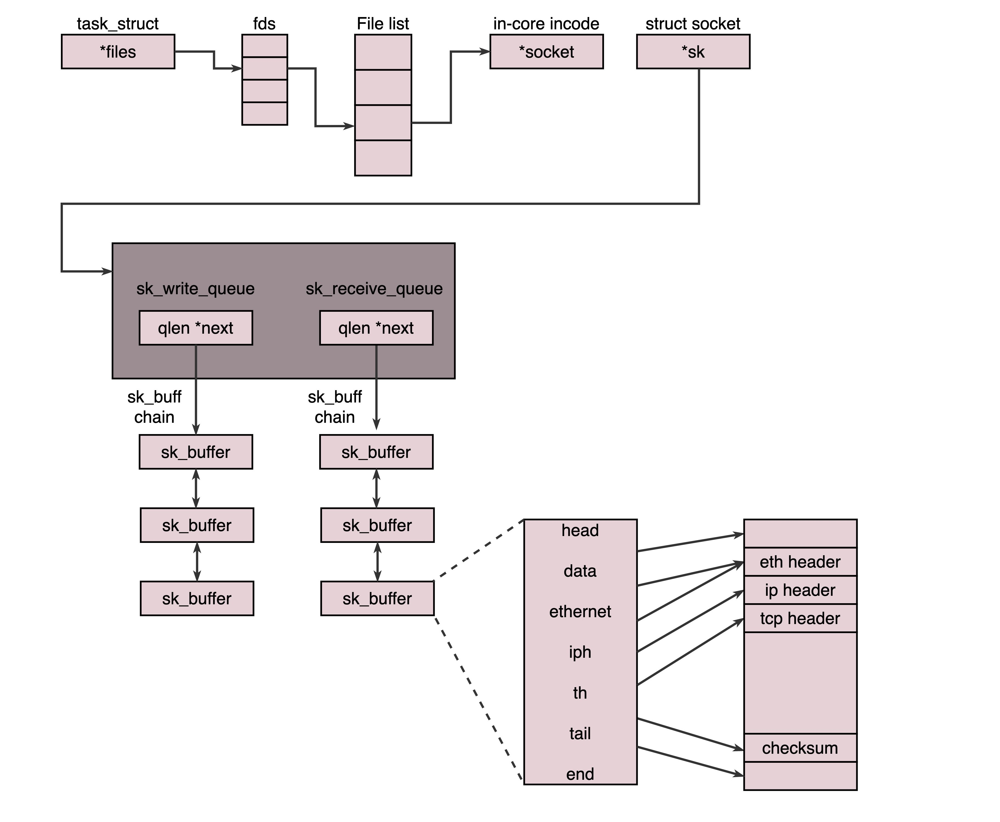

# UDP协议
## TCP和UDP的区别
1. **TCP是面向连接的，UDP是无连接的**。TCP会建立连接，所谓的建立连接，是**客户端和服务端会建立一定的数据结构来维护双方交互的状态，用这样的数据结构来保证所谓的面向连接的特性**。**TCP提供可靠交付**，通过TCP传输的数据，无差错、不丢失、不重复，并且按序到达。  
2. **TCP是面向字节流的，UDP是面向数据报的**。TCP面向字节流，发送的时候是一个流，无头无尾。IP包不是一个流，而是一个一个的IP包，之所以变成了流，是TCP自己的状态维护做的事。UDP继承了IP的特性，基于数据报，一个一个的发，一个一个的收。  
3. **TCP是有拥塞控制的**。它意识到丢包或者网络拥堵，会根据情况调整自己的行为。UDP就不会，应用让我发，我就发。
4. **TCP是一个有状态服务**。它会精确的记录数据包发送了没有，接收到没有，发送到哪个了，应该接收哪个了。而**UDP是无状态服务**，发出去就发出去了。

## UDP包头
  
&emsp;&emsp;当UDP包到达目的机器后，发现MAC地址匹配，就取下来，交给IP层处理。IP层把IP头取下来，发现目标IP匹配，在IP头里还有一个8位协议，存放数据里面到底是TCP还是UDP。发现是UDP，会根据UDP包头的格式去解析，根据目的端口号将数据交给应用程序。到此，传输层就处理完毕，内核的事情也就干完了。  

## UDP的使用场景
1. 需要资源少，在网络情况比较好的内网，或者对于丢包不敏感的应用。DHCP就是基于UDP协议的，因为一般获取IP地址都是内网请求，而且一次获取不到也没事，过一会还可以再请求。
2. 不需要一对一沟通，建立连接，而是可以广播的应用。
3. 需要处理速度快，时延低，可以容忍少数丢包，但是要求即便网络拥塞，也毫不退缩，一往无前。

## UDP的几个应用
1. **网页或者APP的访问**。原来访问网页和手机APP都是基于HTTP协议的，HTTP是基于TCP的，建立连接需要多次交互，时延较大。**QUIC（Quick UDP Internet Connections，快速UDP互联网连接）**是Google提出的一种基于UDP改进的通信协议，它在应用层上，会自己实现快速连接建立、减少重传时延，自适应拥塞控制。
2. **流媒体协议**。直播协议多使用RTMP，它也是基于TCP的，对于直播来讲，显然是不合适的，对于视频来说，偶尔丢几个帧，看视频的人不会感知。很多直播应用，都会基于UDP实现自己的视频传输协议。
3. **实时游戏**。
4. **IoT物联网**。物联网中的终端资源较少，很可能只是一个内存非常小的嵌入式系统，维护TCP协议代价太大；物联网对实时性要求也很高。
5. **移动通信领域**。在4G网络里，移动流量上网的数据面对的协议GTP-U是基于UDP的。

# TCP协议
## TCP包头格式
  
&emsp;&emsp;序号是为了解决乱序问题。确认序号用来解决丢包问题。  
&emsp;&emsp;状态位SYN是发起一个连接，ACK是回复，RST是重新连接，FIN是结束连接。TCP是面向连接的，因而双方要维护连接的状态，这些带状态位的包的发送，会引起双方的状态变更。  
&emsp;&emsp;窗口大小用来做流量控制，通信双方各声明一个窗口，标识自己当前的处理能力，别发的太快，撑死我，也别发的太慢，饿死我。  
&emsp;&emsp;TCP还会做拥塞控制，对于网络拥堵，它无能为力，只能控制自己发送的速度。  

## TCP三次握手
  
&emsp;&emsp;开始时，客户端和服务端都处于**CLOSED**状态。服务端开始监听某个端口，处于**LISTEN**状态。然后客户端主动发起连接SYN，之后处于**SYN-SENT**状态。服务端收到发起的连接，返回SYN，并且ACK客户端的SYN，之后处于**SYN-RCVD**状态。客户端收到服务端的ACK之后，发送ACK的ACK，之后处于**ESTABLISHED**状态。服务端收到ACK的ACK之后，处于**ESTABLISHED**状态。  
&emsp;&emsp;**为什么需要三次，而不是两次**？三次握手除了双方建立连接外，主要还是沟通**TCP包的序号问题**。为了实现可靠传输，发送方和接收方始终需要同步序号，通信双方都会产生一个随机的初始序列号，三次握手需要告知对方序列号的初始值，并确认对方已经收到了序列号的初始值。如果只是两次握手，至多只有连接发起方的起始序列号能被确认，另一方的序列号则得不到确认。  

## TCP四次挥手
  
&emsp;&emsp;主动关闭连接方会处于TIME_WAIT状态，时间是2MSL。**MSL（Maximum Segment Lifetime，报文最大生存时间）** 是任何报文在网络上存在的最长时间，超过这个时间报文将会被丢弃。TCP报文是基于IP协议的，IP头中有一个TTL（Time To Live）域，是IP数据报可以经过的最大路由数，每经过一个路由器，该值就会减1，当此值为0时数据报被丢弃，同时发送ICMP报文通知源主机。  
&emsp;&emsp;为什么主动关闭连接方要保持2MSL的TIME_WAIT状态？1）保证连接正常关闭，因为最后一个ACK可能会丢失，如果丢失了，服务端会认为自己发送的FIN丢失了，它会重试向客户端发送FIN。如果没有TIME_WAIT状态，客户端不再保存这个连接信息，它收到一个不存在的连接包，会响应RST包，导致服务端异常响应；2）保证网络中迷失的数据包正常过期。TIME_WAIT的时长会保证属于这个连接的所有数据包都过期。

## TCP如何保证可靠性
**累计确认**  
&emsp;&emsp;为了保证顺序性，每个包都有一个ID，为了保证不丢包，对于发送的包都要进行应答，这个应答不是一个一个来的，而是会应答某个之前的ID，表示都收到了。为了记录所有发送的包和接收的包，TCP也需要发送端和接收端分别有缓存来保存这些记录。发送端的缓存里是按照包的ID一个个排列的，根据情况分成如下四个部分：  
  
&emsp;&emsp;接收端缓存如下：  
  
&emsp;&emsp;接收已确认：已经发送了确认的数据包，但是还没有被应用程序读取，因此还是在缓存中，占据着缓存的空间。  
&emsp;&emsp;等待接收未确认：还没有收到的数据包，等待接收。  
  
**顺序问题与丢包问题**  
&emsp;&emsp;TCP的**确认与重发机制**能够解决顺序问题和丢包问题。  
&emsp;&emsp;如果发生丢包，一种方法就是**超时重试**。对每一个发送了但是没有ACK的包，都有一个定时器，超过一定时间，就重新尝试。这个时间不宜过短，必须大于往返时间RTT，否则会引起不必要的重传。也不宜过长，否则访问就变慢了。TCP通过采样RTT时间，进行加权平均，算出一个值，而且这个值要不断变化，因为网络状况在不断变化。由于重传时间是不断变化的，因此称为**自适应重传算法**。TCP还有一个策略是**超时间隔加倍**，每当遇到一次超时重传时，都会将下一次超时间隔设置为先前值的两倍，两次超时，说明网络环境差，不宜频繁发送。  
&emsp;&emsp;还有一种机制是**快速重传**。当接收方收到序号大于下一个所期望的序号的报文段，会发送冗余的ACK，表明它所期望的报文段序号。当客户端收到三个冗余的ACK后，就会在定时器过期之前，重传丢失的报文段。  
  
**流量控制**  
&emsp;&emsp;双方在通信时，发送方的速率与接收方的速率不一定相等，如果发送方的发送速率太快，会导致接收方处理不过来，接收方只能把处理不过来的数据放在缓存里，如果缓存区满了，发送方还在发送数据，接收方只能把收到的数据包丢掉，大量的丢包会极大的浪费网络资源。因此，需要控制发送方的发送速率，也就是流量控制。  
&emsp;&emsp;接收方每次在发送确认报文时，会把自己缓存区剩余空间的大小，即接收窗口的大小，也告诉发送方。发送方收到之后，就会调整自己的发送速率，也就是调整自己发送窗口的大小，当发送方收到接收窗口的大小为0时，就会停止发送数据。  
&emsp;&emsp;当出现这种情况时，发送方会定时发送窗口探测数据包，看是否有机会调整窗口大小，当接收方比较慢的时候，要防止低能窗口综合症，别空出一个字节就赶快告诉发送方，然后马上又被填满，可以当窗口太小的时候，不更新窗口，直到达到一定大小，或者缓冲区一半为空，再更新窗口。  
  
**拥塞控制**  
&emsp;&emsp;拥塞控制是防止过多数据注入到网络中，导致网络中路由器或链路过载，拥塞控制是一个全局性的过程，涉及到所有主机、路由器以及与降低网络传输性能相关的所有因素。  
&emsp;&emsp;拥塞控制主要有四个算法：**慢启动、拥塞避免、快速重传、快速恢复**。  
&emsp;&emsp;拥塞控制也是通过窗口大小来控制的，滑动窗口rwnd是怕发送方把接收方缓存塞满，而拥塞窗口cwnd是怕把网络塞满：  
```
LastByteSent - LastByteAcked <= min {cwnd, rwnd}
```  
&emsp;&emsp;**慢启动**：当新建连接时，cwnd初始化为1个最大报文段（MSS）大小，发送端开始按照拥塞窗口大小发送数据，每当有一个报文段被确认，cwnd就增加一个MSS大小，即cwnd的值随着网络往返时间RTT呈指数级增长。  
&emsp;&emsp;**拥塞避免**：慢启动的过程会让cwnd的值快速增长，但是不能一直无限制增长下去，TCP使用了一个叫做慢启动门限（ssthresh，默认65536B）的变量，当cwnd超过此值后，慢启动过程结束，进入拥塞避免阶段。在这个阶段，cwnd的值不再指数级增长，而是随着RTT线性增加，这样就可以避免增长过快导致网络拥塞，慢慢增加调整到网络的最佳值。  
&emsp;&emsp;慢启动和拥塞避免机制都是没有检测到拥塞情况下的行为，当发现拥塞了又该如何调整cwnd的值呢？  
&emsp;&emsp;TCP如何确定网络进入了拥塞状态？TCP认为网络拥塞的主要依据是它重传了一个报文段。TCP对每个报文段都有一个定时器，当超时还没有收到确认，TCP就会重传该报文段，当发生超时时，出现拥塞的可能性就很大，此时，TCP会：把ssthresh值降低为cwnd的一半、将cwnd重新设置为1、重新进入慢启动过程。  
&emsp;&emsp;TCP还有一种情况会进行重传：就是收到三个相同的ACK。TCP利用三个相同的ACK来判定数据包丢失，此时会进行**快速重传**，快速重传做的事情有：把ssthresh设置为cwnd值的一半、把cwnd设置为ssthresh的值、重新进入拥塞避免阶段。  
&emsp;&emsp;**快速恢复**算法是在快速重传算法基础上添加的，当出现超时时，就执行：把ssthresh值降低为cwnd的一半、将cwnd设置为1、重新进入慢启动；而当收到三个冗余的ACK时，执行快速重传：把ssthresh值设置为cwnd的一半、将cwnd设置为ssthresh的值、进入拥塞避免阶段。  
  

# 套接字Socket
&emsp;&emsp;Socket为“插口”或者“插槽”。可以想象一根网线，一头插在客户端，一头插在服务器，然后进行通信，所以在通信之前，双方都要建立一个Socket。  
## 基于TCP协议的Socket程序函数调用
  
&emsp;&emsp;服务端要先监听一个端口，一般是调用bind()函数，给这个Socket赋予一个IP地址和端口。当服务端有了IP地址和端口号，就可以调用listen()函数进行监听，调用这个函数后，服务端就进入了LISTEN状态，此时客户端就可以发起连接了。  
&emsp;&emsp;在内核中，为每个Socket维护两个队列。一个是已经建立了连接的队列，这时候连接三次握手已经完毕，处于ESTABLISHED状态；一个是还没有完全建立连接的队列，这时候三次握手还没有完成，处于SYN_RCVD状态。  
&emsp;&emsp;接下来，服务端调用accept()函数，拿出一个已经完成的连接进行处理，如果没有已完成连接，就要等着。  
&emsp;&emsp;服务端等待的时候，客户端可以通过connect()函数发起连接，客户端要在参数中指明要连接的IP地址和端口号，然后开始发起三次握手，内核会给客户端分配一个**临时的端口**。一旦握手成功，服务端的accept()就会返回另一个Socket。  
&emsp;&emsp;对于服务端来说，**监听的Socket和真正用来传数据的Socket是两个**，一个叫做**监听Socket**，一个叫做**已连接Socket**。  
&emsp;&emsp;连接建立成功后，双方就可以通过read()和write()函数来读写数据，就像往一个文件流里面写东西一样。  
&emsp;&emsp;Socket在Linux中就是以文件的形式存在的，写入和读出都是通过文件描述符进行的。内核中，每个进程的数据结构task_struct中都有一个指向文件描述符数组的指针，来列出这个进程打开的所有文件的文件描述符。每个文件都有一个inode，只不过Socket的inode不像真正的文件系统一样，保存在硬盘上，而是在内存中。在这个inode中，指向了Socket在内核中的Socket结构，在这个结构中，主要有两个队列：**发送队列**和**接收队列**。这两个队列里保存的是一个缓存sk_buff，这个缓存里能够看到完整的包的结构：  
  

## 基于UDP协议的Socket程序函数调用
  
&emsp;&emsp;UDP没有连接，不需要三次握手，也不需要调用listen()和connect()。但是UDP交互也需要IP地址和端口号，因此也需要bind()。UDP是没有维护连接状态的，因而不需要每对连接都建立一组Socket，而是只要有一个Socket，就能够和多个客户端通信。也正是因为没有连接状态，每次通信都调用sendto和recvfrom，都可以传入IP地址和端口。  

## 服务器如何接更多项目
&emsp;&emsp;调用上述Socket函数，就可以实现一个网络交互程序了。就像上面的过程一样，在建立连接后，进行一个while循环，客户端发了收，服务端收了发。如果使用这种方法，基本上只能一对一沟通，这肯定是不行的。  
  
&emsp;&emsp;先看一下**最大连接数**的理论值，系统会用一个四元组来标识一个TCP连接：`{本机IP，本机端口，对端IP，对端端口}`。  
&emsp;&emsp;服务器通常固定在某个本地端口上监听，等待客户端的请求。因此，服务端TCP连接四元组中只有对端IP，即客户端IP地址和端口，因此，最大TCP连接数=客户端IP数*客户端端口数。对IPv4，客户端的IP最多为2^32，客户端端口数最多为2^16，即服务端单机最大TCP连接数约为2^48。  
&emsp;&emsp;服务端最大并发TCP连接数远远不可能达到理论上限。首先是**文件描述符限制**，Socket都是文件，所以首先要通过ulimit配置每个进程能够打开的文件描述符上限；另一个限制是**内存**，每个TCP连接都要占用一定的内存，操作系统是有限的。  
&emsp;&emsp;在资源有限的情况下，要想处理更多的连接，就需要降低每个连接消耗的资源数。  
  
### 方式一：多进程
&emsp;&emsp;监听到来的请求，一旦建立了一个连接，就会有一个已连接Socket，这时候就可以创建一个子进程，然后将基于已连接Socket的交互交给这个新的子进程。  
&emsp;&emsp;在Linux下，创建子进程使用fork函数，在父进程的基础上完全拷贝一个子进程。在Linux内核中，会复制文件描述符列表、内存空间等。根据fork的返回值来区分父进程和子进程，如果返回值是0则是子进程；返回其他整数则是父进程。  
  
&emsp;&emsp;因为复制了文件描述符表，父进程刚才因为accept()创建的已连接Socket也是一个文件描述符，也会被子进程获得。接下来，子进程就可以通过这个已连接Socket和客户端进行互通了，当通信完毕，就可以退出进程，父进程可以通过子进程的进程ID查看子进程是否完成。  
### 方式二：多线程
&emsp;&emsp;进程的创建和销毁开销是很大的，因此可以采取多线程，相比于进程，线程要轻量级很多。在Linux下，通过pthread_create()创建一个线程，也是调用do_fork，不同的是，虽然新的线程会在task列表新创建一项，但是像文件描述符列表、进程空间等资源还是共享的，只不过多了一个引用而已。  
  
&emsp;&emsp;新的线程也可以通过已连接Socket处理请求，从而达到并发处理的目的。  
  
&emsp;&emsp;基于多进程或者多线程的模型，还是有问题的。新到来一个TCP连接，就需要分配一个进程或者线程。一台机器无法创建很多进程或者线程。有个**C10K**，它的意思是一台机器要维护1万个连接，就要创建1万个进程或者线程，操作系统是无法承受的。如果要维护1亿用户在线需要10万台服务器，成本非常高。  
### 方式三：IO多路复用，一个线程维护多个Socket
&emsp;&emsp;由于Socket是文件描述符，因而某个线程盯着的所有Socket，都放在一个文件描述符集合fd_set中，然后该线程调用select函数来监听文件描述符集合是否有变化。一旦有变化，就会依次查看每个文件描述符，那些发生变化的文件描述符在fd_set对应的位都设置为1，表示Socket可读或者可写，从而进行读写操作。然后再调用select，接着盯着下一轮的变化。  
### 方式四：IO多路复用，从“派人盯着”到“有事通知”
&emsp;&emsp;select函数有一个缺点，每次Socket所在的文件描述符集合中有Socket发生变化，都需要通过轮询的方式。采取这种方式，能够同时盯的Socket数量是由FD_SETSIZE限制的。  
&emsp;&emsp;如果改成事件通知的方式，就会好很多，不需要轮询，当某个Socket发生变化时，主动通知，然后线程再去进行相应的处理。  
&emsp;&emsp;能完成这件事的函数叫做epoll，它在内核中的实现不是轮询，而是通过注册callback函数的方式，当某个文件描述符发生变化的时候，就会主动通知。  
  
&emsp;&emsp;假设进程打开了多个Socket的文件描述符，现在需要通过epoll来监听这些Socket是否有事件发生。epoll_create会创建一个epoll对象，也是一个文件，对应一个文件描述符，同样也对应着打开文件列表里的一项。在这项里有一个红黑树，在红黑树里，保存这个epoll要监听的所有Socket。  
&emsp;&emsp;红黑树的每个节点指向一个结构，将这个结构挂在被监听的Socket的事件列表中，当一个Socket来一个事件的时候，可以从这个列表中得到epoll对象，并调用callback通知它。  
&emsp;&emsp;这种通知方式使得监听Socket数据增加的时候，效率并不会大幅度下降，能够同时监听的Socket数目也非常多了。上限就是系统定义的、进程打开的最大文件描述符个数。  