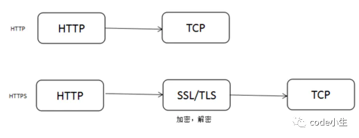
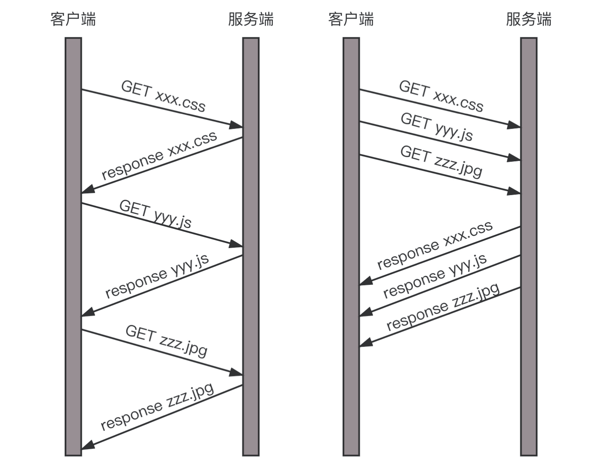
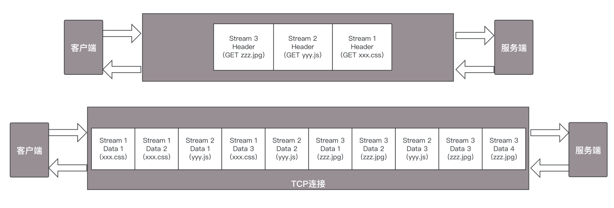

# HTTP协议
## HTTP请求的准备
&emsp;&emsp;当访问某个域名时，首先会根据DNS协议，得到对应的IP地址。由于HTTP协议是基于TCP协议的，接下来，就要先建立TCP连接。  
&emsp;&emsp;目前使用的HTTP协议大部分都是1.1，在1.1的协议里，默认开启了Keep-Alive，这样建立的TCP连接，可以在多次请求中复用。  

## HTTP请求的构建
&emsp;&emsp;建立了TCP连接后，浏览器就要发送HTTP请求，请求格式如下：  
  
&emsp;&emsp;HTTP请求报文分为三大部分：**请求行、首部、正文实体**。  

## HTTP请求的发送
&emsp;&emsp;HTTP是基于TCP协议的，它使用面向连接的方式发送请求，通过stream二进制流的方式传给对方。到了TCP层，它会把二进制流变成一个个报文段发送给服务器。  
&emsp;&emsp;在发送每个报文段的时候，都需要对方有一个回应的ACK，保证报文可靠到达对方。如果没有回应，TCP这一层回重传，直到可以到达。同一个包可能被重传很多次，但是HTTP层不知道这一点，因为是TCP层在埋头苦干。  
&emsp;&emsp;TCP层发送每一个报文的时候，会把源IP和目的IP放入IP头部交给IP层，IP层会查看目标IP跟自己是否在同一个网段，如果是，就发送ARP请求目标IP地址的MAC地址，然后将源MAC和目标MAC放入MAC头部，发送出去即可；如果不在同一个网段，就需要发送到网关，需要通过ARP协议请求网关的MAC地址，然后将源MAC和网关的MAC放入MAC头，发送出去。  
&emsp;&emsp;网关根据路由协议找到下一跳路由器，将包发给下一跳路由器，最终到达目标所在局域网，目标机器收到这个包，发现IP地址符合，根据IP头中的协议项，直到自己的上一层是TCP协议，于是解析TCP的头，里面有序列号，需要看一看这个序列包是不是想要的，如果是就放入缓存中然后返回一个ACK，不是就丢弃。  
&emsp;&emsp;TCP头里还有端口号，根据端口号找到对应的应用程序，把包发给这个应用程序处理。  

## HTTP返回的构建
  
&emsp;&emsp;HTTP响应状态码：1xx是信息响应，2xx表示成功响应，3xx表示重定向，4xx表示客户端错误，5xx表示服务器错误。  

## HTTP 2.0
### HTTP基本优化
&emsp;&emsp;影响一个HTTP网络请求的关键因素主要有两个：带宽和延迟。  
* 带宽：在拨号上网阶段，带宽是一个非常影响请求的问题，但是现在的网络基础设施已经使得带宽得到极大的提升，不用再担心带宽的问题，因此就只剩下延迟了。  
* 延迟：
  * 浏览器阻塞：浏览器会因为一些原因阻塞请求。浏览器对于同一个域名，同时只能有4个连接（根据浏览器内核不同会有差异），超过浏览器最大连接数限制，后续请求就会被阻塞。
  * DNS查询：DNS查询也非常耗时，通常会利用DNS缓存来减小这个延迟。
  * 建立连接：HTTP是基于TCP的，浏览器最快也要在第三次握手时才能携带HTTP请求报文。如果连接无法复用，会导致每次请求都要经历三次握手和慢启动，非常耗时。

### HTTP1.0和HTTP1.1的区别
1. **缓存处理**。
2. **带宽优化及网络连接的使用**。
3. **错误通知的管理**。
4. **Host头处理**。
5. **长连接**。HTTP1.1支持长连接和请求的流水线pipeline处理，在一个TCP连接上可以传送多个HTTP请求和响应，减少了建立和关闭连接的延迟，在HTTP1.1中默认开启Connection：Keep-Alive，默认使用长连接。  

### HTTPS与HTTP的区别
  
&emsp;&emsp;HTTP运行在TCP之上，传输的内容都是明文，HTTPS运行在SSL/TLS之上，SSL/TLS运行在TCP之上，所有传输的内容都是经过加密的。  

### HTTP2.0相比HTTP1.x的新特性
&emsp;&emsp;HTTP1.1每次通信都要携带完整的HTTP头，HTTP2.0会对HTTP头进行压缩，将原来每次都要携带的大量key-value在两端建立一个索引表，对相同的头只发送其在索引表中的索引。  
&emsp;&emsp;HTTP2.0协议将一个TCP连接，切分成多个流，每个流都有自己的ID，而且流可以是客户端发往服务端，也可以是服务端发送客户端。  
&emsp;&emsp;HTTP2.0将所有的传输信息分割成更小的帧，并对它们采用二进制格式编码。常见的帧有Header帧，用于传输Header内容，并且会开启一个新的流。再就是Data帧，用来传输正文实体。多个Data帧属于同一个流。  
&emsp;&emsp;通过这两种机制，HTTP2.0的客户端可以将多个请求分到不同的流中，然后将请求内容拆成帧，进行二进制传输，这些帧可以打散乱序发送，然后根据每个帧首部的流标识符重新组装，并且可以根据优先级，决定优先处理哪个流的数据。  
&emsp;&emsp;假设一个页面要发送三个独立的请求，一个获取css，一个获取js，一个获取图片jpg。如果使用HTTP1.1就是串行的，但是如果使用HTTP2.0，就可以在一个连接里，客户端和服务端都可以同时发送多个请求或回应，而且不用按照顺序一对一对应：  
  
&emsp;&emsp;HTTP2.0其实就是将三个请求变成三个流，将数据分成帧，乱序发送到一个TCP连接中：  
  
&emsp;&emsp;HTTP2.0成功解决了HTTP1.1的队首阻塞问题，同时，也不需要通过HTTP1.x的pipeline机制用多条TCP连接来实现并行请求与响应，将页面的多个数据css、js、jpg通过一个数据链接进行传输，能够加快页面组件的传输速度。  

# HTTPS协议
&emsp;&emsp;普通的HTTP协议是存在安全问题的。解决安全问题的一般思路就是**加密**。加密分为两种方式：**对称加密**、**非对称加密**。  
&emsp;&emsp;在对称加密算法中，加密和解密使用的密钥是相同的。因此，要保证安全性，密钥要做好保密。  
&emsp;&emsp;在非对称加密算法中，加密使用的密钥和解密使用的密钥不同，一把作为公开的公钥，另一把是谁都不能给的私钥。公钥加密的信息，只有私钥能解密。私钥加密的信息，之后公钥能解密。  
&emsp;&emsp;相比之下，对称加密算法效率更高，性能也好，所以交互的场景多用对称加密。  

## 对称加密
&emsp;&emsp;对称加密的问题在于双方如何约定密钥，因为如果这个密钥在网络上传输，还是存在安全问题的。  

## 非对称加密
&emsp;&emsp;非对称加密的私钥在服务端，不会在互联网上传输。对应私钥的公钥是可以在互联网上随意传播的，只要服务端把这个公钥给客户端，双方就可以通信了。就算黑客在中间截获了这个报文，因为它没有私钥，它也是解不开的。  
&emsp;&emsp;这种方式存在一个问题，就是服务端给客户端的回复，是用私钥加密的，互联网上人人都可以打开它（因为公钥已经在互联网上传播过了）。那服务端能用公钥加密的，当然不能，因为如果用公钥加密，就必须用私钥解密，但是私钥只有它自己知道。  
&emsp;&emsp;为了解决这个问题，只使用一对公钥私钥是不够的，客户端也要有自己的公钥和私钥，并且客户端要把自己的公钥给到服务端。客户端给服务端发送数据，用服务端的公钥加密；服务端给客户端发送数据，用客户端的公钥加密。这样，即使数据包被黑客截获，由于它没有私钥也是解不开的。  

### 数字证书
&emsp;&emsp;不对称加密也会有同样的问题，如何将不对称加密的公钥给对方？一种是放在一个公网的地址上，让对方下载；另一种就是在建立连接的时候，传给对方。  
&emsp;&emsp;这两种方法都有相同的问题。就是，作为一个普通网民，你如何鉴别别人给你的公钥是对的，会不会有人冒充服务端，发给你一个公钥。  
  
&emsp;&emsp;当服务端生成一对私钥和公钥之后，就需要权威部门介入了，就像每个人都可以打印自己的简历，说自己是谁，但是只有公安局盖章的户口本才能证明你是你。这个由权威部门颁发的称为**证书**。  
&emsp;&emsp;证书里有**公钥**、证书的**所有者**、证书的**发布机构**、证书的**有效期**。  
&emsp;&emsp;会不会有人假冒权威机构颁发证书呢？就像有假身份证、假户口本一样。生成证书需要发起一个证书请求，然后将这个请求发给一个权威机构去认证，这个权威机构称为**CA（Certificate Authority）**。权威机构会给这个证书盖一个章，称为**签名算法**。  
&emsp;&emsp;怎么签名才能保证是真的权威机构签名的呢？当然要用只掌握在权威机构手里的东西签名才行，也就是CA的私钥。签名算法工作流程为：一般对信息做一个Hash计算，得到一个Hash值，这个过程是不可逆的，即无法通过Hash值得到原信息内容。在把信息发送出去时，把这个Hash值加密，作为一个签名和信息一起发送出去。  
&emsp;&emsp;客户端不会从服务端得到一个公钥，而是得到一个证书，这个证书有一个发布机构CA，客户端使用CA的公钥，去解密证书的签名，如果解密成功，Hash也对得上，说明服务端的公钥没有问题。  
  
&emsp;&emsp;如何确定CA的公钥是对的呢？CA的公钥需要更牛的CA给它签名，然后形成CA的证书。这样层层上去，直到全球皆知的几个著名大CA，称为**root CA**，做最后的背书。  

## HTTPS工作模式
&emsp;&emsp;非对称加密在性能上不如对称加密，将两者结合起来，公钥私钥用来传输对称加密的密钥，而真正的双方大数据量的通信都是通过对称加密进行的。这就是HTTPS协议的总体思路：  
  
1. 客户端发送Client Hello，以明文传输TLS版本信息、加密套件候选列表、压缩算法候选列表等信息。另外，还会发送一个随机数，在协商密钥时使用。
2. 服务端返回Server Hello，告诉客户端，服务器选择使用的协议版本、加密套件、压缩算法，还有一个随机数。
3. 服务端给客户端发送一个证书。
4. 客户端进行证书验证，验证通过后，客户端计算产生随机数字Pre-master，用证书中的公钥加密，再发送给服务器，服务器可以通过私钥解密出来。
5. 到目前为止，客户端和服务器都有了三个随机数：自己的、对端的、以及刚生成的Pre-Master随机数。通过这三个随机数，可以在客户端和服务器产生相同的对称密钥。
6. 有了对称密钥，客户端就可以说Change Cipher Spec，然后发送一个Encrypted Handshake Message，将已经商定好的参数，采用密钥进行加密，发送给服务器用于数据与握手验证。
7. 服务器也发送Change Cipher Spec和Encrypted Handshake Message。
8. 双方握手结束后，就可以通过对称密钥进行加密传输了。

&emsp;&emsp;上面的过程只包含了HTTPS的单向认证，也即客户端验证服务端的证书，是大部分的场景，在更严格安全要求的情况下，可以启动双向认证，双方互相验证证书。  

# 流媒体协议

# P2P协议
&emsp;&emsp;有一种下载文件的方式，是通过**FTP**协议，即**文件传输协议**。FTP采用两个TCP连接来传输一个文件：
* **控制连接**：服务器以被动方式打开21端口，客户端主动发起连接。该连接将命令从客户端传给服务器，并传回服务器的应答。常用的命令有：list、reter、store。
* **数据连接**：每当一个文件在客户端与服务器之间传输时，就创建一个数据连接。

## FTP的两种工作模式
&emsp;&emsp;每传输一个文件，都要建立一个全新的数据连接。FTP有两种工作模式，分别是**主动模式PORT**和**被动模式PASV**。  
&emsp;&emsp;主动模式下，客户端随机打开一个大于1024的端口N，向服务器的命令端口21发起连接，同时开放N+1端口监听，并向服务器发出“port N+1”命令，由服务器从自己的数据端口20，主动连接到客户端指定的数据端口N+1。  
&emsp;&emsp;被动模式下，当开启一个FTP连接时，客户端打开任意两个本地端口N和N+1，第一个端口连接服务器的21端口，提交PASV命令。然后，服务器会开启一个任意端口P，并通知客户端，客户端取得端口号后，通过N+1号端口连接服务器的端口P，然后在两个端口之间进行数据传输。  

## P2P
&emsp;&emsp;无论是HTTP还是FTP，都有一个比较大的缺点，就是**难以解决单一服务器的带宽压力**。  
&emsp;&emsp;P2P是**peer-to-peer**，资源开始并不集中存储在某些设备上，而是分散的存储在多台设备上。这些设备称为peer。  
&emsp;&emsp;当要下载一个文件的时候，只要得到那些已经存在了文件的peer，并且和这些peer之间，建立点对点的连接，不需要到中心服务器，就可以就近下载文件。一旦下载了文件，你也就成为了peer的一员，其他机器也可以从你这里下载文件。  

## 种子（.torrent）文件
&emsp;&emsp;当想要下载文件时，怎么知道哪些peer有这个文件呢？  
&emsp;&emsp;这就要用到**种子**，即 **.torrent文件**。.torrent文件由两部分组成，分别是：**announce（tracker URL）**和**文件信息**。  
&emsp;&emsp;文件信息如下：  
* **info区**：该种子有几个文件、文件有多长、目录结构，以及目录和文件名。
* **Name字段**：顶层目录名字。
* **每个段的大小**：BitTorrent（简称BT）协议把一个文件分成很多个小段，然后分段下载。
* **段哈希值**：将整个种子中，每个段的SHA-1哈希值拼在一起。

&emsp;&emsp;下载时，BT客户端首先解析.torrent文件，得到tracker地址，然后连接tracker服务器。tracker服务器回应下载者的请求，将其他下载者的IP提供给下载者。下载者再连接其他下载者，根据.torrent文件，两者分别告知对方自己已有的块，然后交换对方没有的数据。  

## 去中心化网络（DHT）
&emsp;&emsp;能否彻底去中心化呢？  
&emsp;&emsp;去中心化网络DHT（Distributed Hash Table），每个加入这个网络的机器，都要负责存储这个网络里的资源信息和其他成员的联系信息，相当于所有人一起构成了一个庞大的分布式存储数据库。  