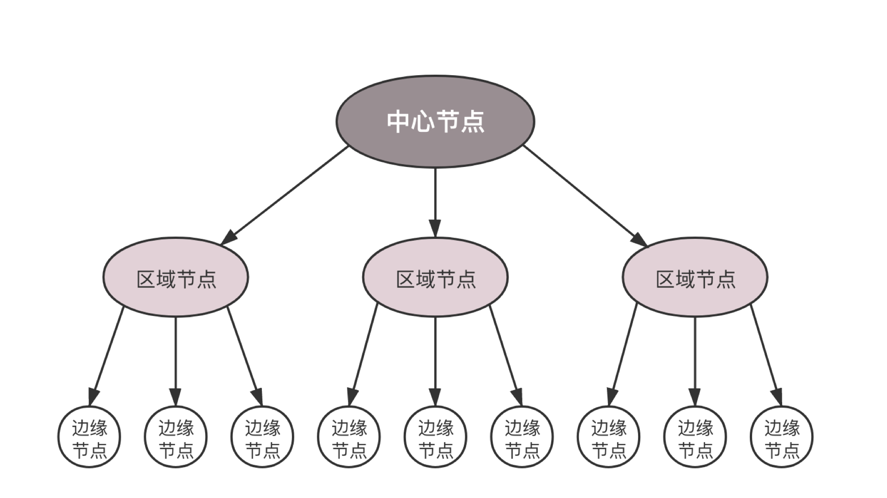
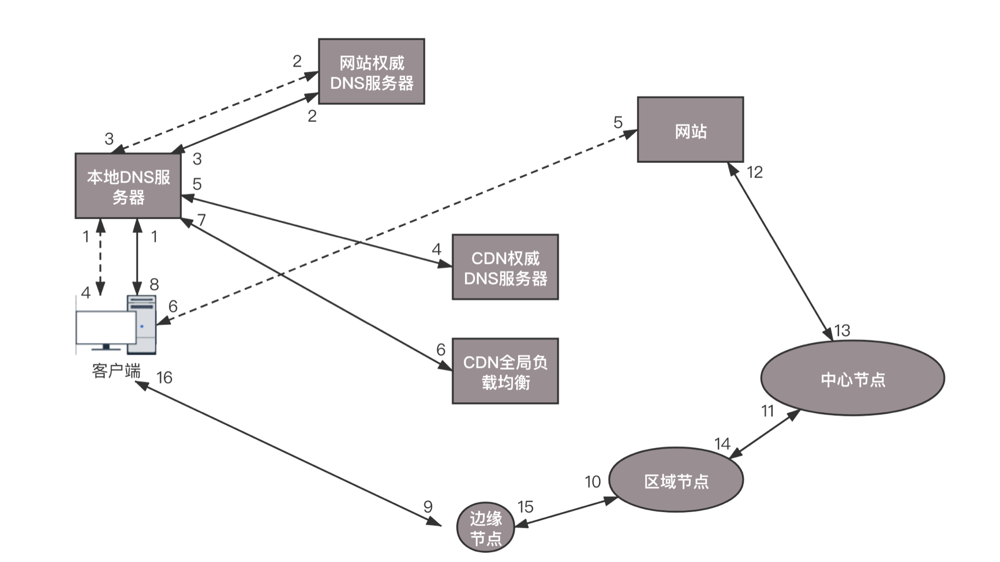

# DNS协议
## DNS服务器
&emsp;&emsp;我们上网使用的都是域名，而不是IP地址，因此需要DNS协议来解析域名。DNS非常重要，每个人上网都要使用它，一旦DNS服务器出故障，整个互联网都会瘫痪。因此，**DNS服务器，一定要设置成高可用、高并发和分布式的**。因此，就有了如下的树状结构：  
  
* 根DNS服务器：返回顶级域DNS服务器的IP地址。
* 顶级域DNS服务器：返回权威DNS服务器的IP地址。
* 权威DNS服务器：返回相应主机的IP地址。

## DNS解析流程
  
&emsp;&emsp;为了提高DNS解析性能，很多网络会就近部署DNS缓存服务器。DNS解析流程如下：  
1. 首先查看本地DNS缓存，如果查询到就直接返回。
2. 本地缓存查询不到，则会发送DNS请求到本地域名服务器（本地DNS服务器），如果是通过DHCP配置，本地DNS服务器则由你的网络服务商（ISP），如电信、移动等自动分配，它通常就在网络服务商的某个机房。
3. 本地DNS服务器上也会缓存一张域名与IP地址的对应关系表，如果能找到想访问的域名，就直接返回其IP地址。如果没有，本地DNS服务器会去访问它的根域名服务器。根域名服务器是最高层次的，全球共有13套，它不直接用于域名解析，但会指明一条道路。
4. 根DNS收到本地DNS的请求后，发现后缀是.com，就会返回.com对应的顶级域名服务器的地址。
5. 接下来，本地DNS就会向顶级域名服务器发送请求，顶级域名服务器是.com、.net、.org这些一级域名对应的服务器，它管理的是二级域名。它会把要访问的域名对应的权威DNS服务器的地址返回。
6. 本地DNS就会转向访问权限DNS服务器，权威DNS服务器才是域名解析结果的原出处，它会把查询后的IP地址告诉本地DNS。
7. 本地DNS再将IP地址返回给客户端，客户端和目标建立连接。

## 负载均衡
&emsp;&emsp;站在客户端角度，这是一次DNS递归查询过程。本地DNS全权代理，它只要坐等结果即可。在这个过程中，DNS还可以做负载均衡。  
&emsp;&emsp;DNS首先可以做**内部负载均衡**。某个应用要访问另一个应用，如果配置另一个应用的IP地址，那么这个访问就是一对一的。当被访问的应用撑不住的时候，可以部署多个实例，只要配置成访问域名，在域名解析时，配置策略，这次返回第一个IP，下次返回第二个IP，就可以实现负载均衡了。  
&emsp;&emsp;DNS还可以做**全局负载均衡**。为了保证应用高可用，往往会部署在多个机房，每个机房会有自己的IP地址，当用户访问某个域名时，可以轮询访问多个数据中心，如果一个数据中心因为某种原因挂了，只要在DNS服务器里，将这个数据中心对应的IP地址删除即可，这样实现高可用。  
  

# CDN
&emsp;&emsp;想要访问一个网站，指定其域名，DNS就会将域名解析为IP地址。用户请求这个地址，就会返回一个网页。  
&emsp;&emsp;当去电商网站下单买东西时，这个东西不一定要从电商总部的中心仓库送过来，电商网站在全国各地建立了仓库，会就近配送。  
&emsp;&emsp;全球有这么多数据中心，无论在哪里上网，临近不远的地方基本都有数据中心，可以在这些数据中心里部署几台机器，形成一个缓存的集群来缓存部分数据。这些分布在各个地方的各个数据中心的节点，称为**边缘节点**。  
&emsp;&emsp;由于边缘节点数目较多，但是每个集群规模比较小，不可能缓存所有的东西，因而可能无法命中。因此在边缘节点上会有区域节点，规模更大，缓存的数据更多，命中概率也会更大。区域节点之上是中心节点，规模更大，缓存数据更多。如果还不命中，只能回源网站访问了。  
  
&emsp;&emsp;这就是**CDN分发系统的架构**。CDN系统的缓存，也是一层一层的，能不访问后端真正的源，就不打扰它。  
  
&emsp;&emsp;有了这个分发系统，**客户端如何找到相应的边缘节点进行访问呢？**  
&emsp;&emsp;基于DNS的全局负载均衡主要用来选择一个就近的同样运营商的服务器进行访问。CDN分发网络也是一个分布在多个区域、多个运营商的分布式系统，也可以用相同的思路选择最合适的边缘节点。  
  
&emsp;&emsp;**在没有CDN的情况下**，用户输入一个域名，客户端访问本地DNS服务器，如果本地DNS服务器有缓存，则返回IP地址；否则，递归查询到权威DNS服务器，它会返回其IP地址。客户端直接访问这个IP地址，就访问到了这个网站。  
&emsp;&emsp;**有了CDN之后**，假设用户要访问 www.web.com 这个域名，在权威DNS服务器上，会设置一个CNAME别名，转向另外一个域名 www.web.cdn.com ，返回给本地DNS服务器。本地DNS服务器拿到这个域名后，需要继续解析这个新的域名，此时，再访问的就不是 web.com 的权威DNS服务器了，而是 web.cdn.com 的权威DNS服务器，这是CDN自己的权威DNS服务器。在这个服务器上，还是会设置一个CNAME，指向另外一个域名，即CDN网络的全局负载均衡器。  
&emsp;&emsp;接下来，本地DNS服务器会去请求CDN全局负载均衡器解析域名，全局负载均衡器会为用户选择一台合适的缓存服务器的IP地址为其提供服务，选择的依据包括：
* 根据用户IP地址，判断哪一台服务器距离用户最近；
* 用户所处的运营商；
* 根据用户所请求的URL中携带的内容名称，判断哪一台服务器上有用户所需的内容；
* 查询各个服务器当前的负载情况，判断哪一台服务器尚有服务能力。

&emsp;&emsp;基于这些条件，进行综合分析，全局负载均衡服务器会返回一台缓存服务器的IP地址。  
&emsp;&emsp;本地DNS服务器会缓存这个IP地址，然后将IP返回给客户端，客户端去访问这个边缘节点。如果这台缓存服务器上没有用户想要的内容，那么这台服务器就向它的上一级缓存服务器请求内容，直至追溯到网站的源服务器将内容拉到本地。  
  
  
&emsp;&emsp;静态资源不怎么变，所以适合缓存。  
&emsp;&emsp;在进入数据中心的时候，希望通过最外层接入层的缓存，将大部分静态资源的访问拦在边缘。而CDN更进一步，将这些静态资源缓存到离用户更近的数据中心，越接近客户，访问性能越好，时延越低。CDN最擅长的是缓存静态数据。  

# 数据中心

# VPN
&emsp;&emsp;有的公司有多个数据中心，需要将多个数据中心连接起来，或者需要办公室和数据中心连接起来。有三种方式：
1. 第一种方式是走公网，但是公网太不安全，数据隐私问题难以解决。
2. 第二种方式是租用专线，这是土豪的做法，需要花很多钱。
3. 第三种方式是用VPN来连接，这种方法比较折中，安全又不贵。

  
&emsp;&emsp;**VPN**，全名**Virtual Private Network，虚拟专用网**，就是利用开放的公众网络，建立专用数据传输通道，将远程的分支机构、移动办公人员等连接起来。  

## VPN是如何工作的
&emsp;&emsp;VPN通过隧道技术在公众网络上仿真一条点到点的专线，是通过利用一种协议来传输另外一种协议的技术，涉及三种协议：**乘客协议、隧道协议、承载协议**。  
&emsp;&emsp;以IPsec协议为例：  
  
&emsp;&emsp;直接使用公网并不安全，一种安全的VPN，**IPsec VPN**，是基于IP协议的**安全隧道协议**。为了保证在公网上信息的安全，会采取一定的机制保证安全性，例如加密等方式。  
&emsp;&emsp;VPN可以将一个机构的多个数据中心通过隧道的方式连接起来，让机构感觉在一个数据中心里面。  

# 移动网络