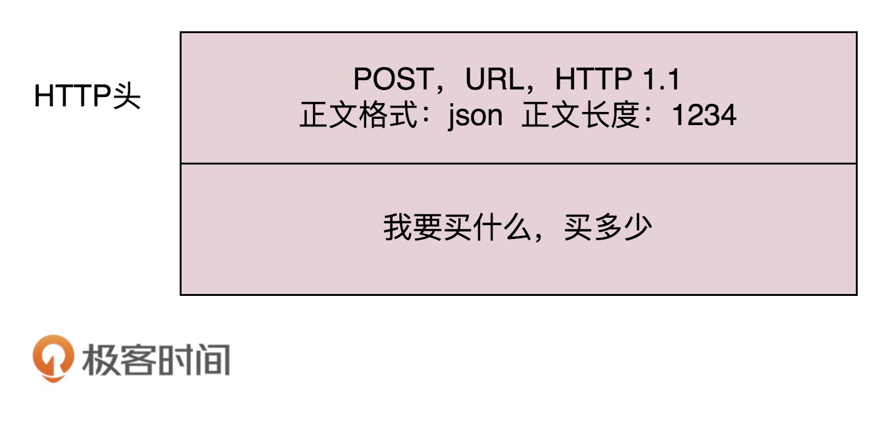
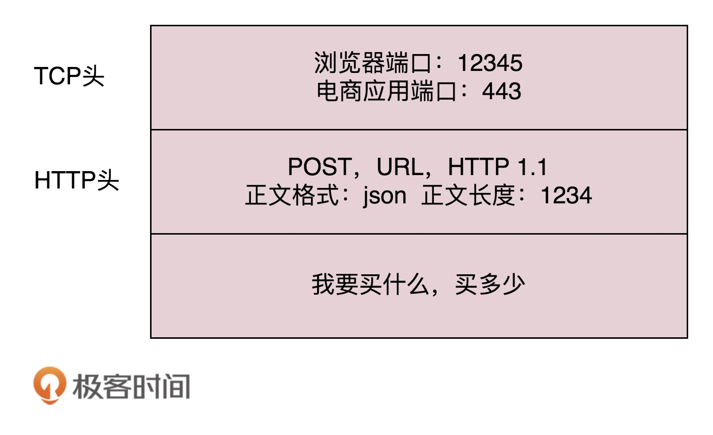
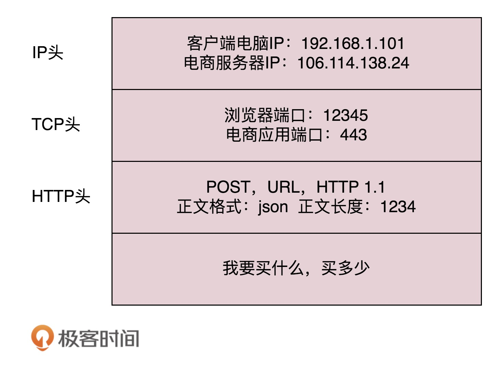
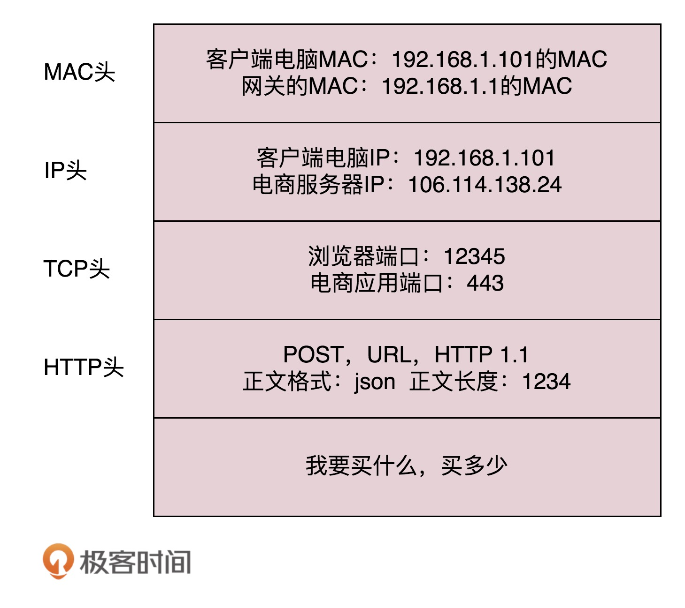
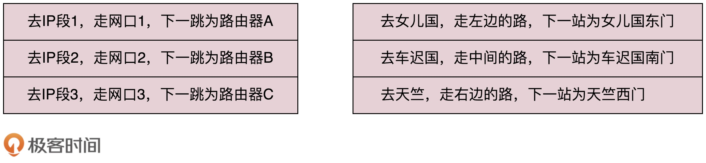
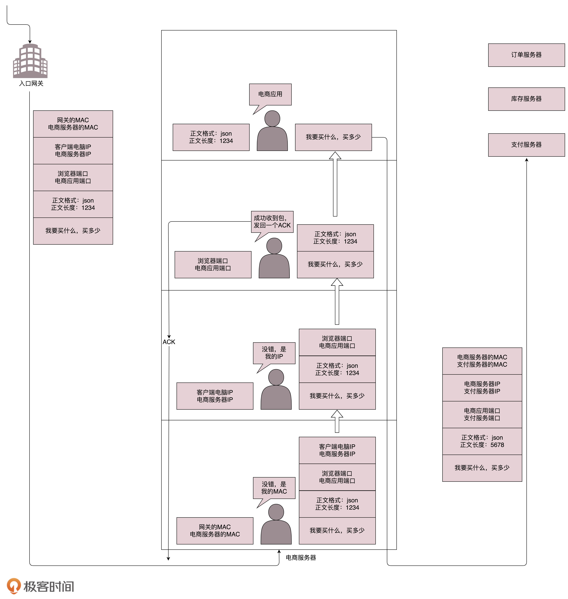

# 常用的网络协议
&emsp;&emsp;在浏览器里输入网址“https://www.kaola.com”。浏览器只知道名字是“www.kaola.com”，但是不知道具体的IP地址。因此，首先要根据**DNS协议**去查找IP地址。  
&emsp;&emsp;得到了目标IP地址，浏览器开始打包请求，对于普通请求会使用HTTP协议；但是对于例如购物请求，需要进行加密传输，会使用HTTPS协议：  
  
&emsp;&emsp;DNS、HTTP、HTTPS都是**应用层**协议。经过应用层封装之后，浏览器会把应用层的包交给**传输层**，通过socket编程来实现。传输层协议包括**TCP**和**UDP**两种：  
  
&emsp;&emsp;传输层封装完毕后，会交给操作系统的**网络层**。网络层协议是IP协议，IP协议需要封装上源IP地址和目的IP地址：  
  
&emsp;&emsp;操作系统知道了目标IP地址，就要根据目标IP地址去找目标机器，操作系统会先判断目标IP是在本地（同一个局域网内）还是在外地，如果是外地就要先去**网关**。操作系统启动的时候，会被**DHCP协议**配置IP地址以及默认网关的IP地址192.168.1.1。  
&emsp;&emsp;操作系统想把数据包发送给网关，只知道网关的IP地址是不够的，必须知道网关的MAC地址。此时就要依靠**ARP协议**来获取MAC地址。然后，**数据链路层**把源MAC和目标MAC封装好：  
  
&emsp;&emsp;接下来，由网卡把数据包发送出去，这个数据包会根据MAC地址到达网关。网关往往是一个路由器，它会根据路由表来判断要到达目标IP地址，应该怎么走。  
&emsp;&emsp;路由器就像一个个国家的城关，每个城关都连着两个国家，每个国家相当于一个局域网，在局域网内部，都可以使用本地的MAC地址进行通信。  
&emsp;&emsp;一旦跨越城关，就需要解封装拿到IP头，根据源IP地址和目标IP地址，查询路由表：  
  
&emsp;&emsp;路由器是知道这些知识的，因为路由器和路由器之间会经常交换信息，通过**路由协议**来实现，常用的有**OSPF**和**BGP**。  
&emsp;&emsp;如果到达目标机器之前，需要经过多个网关，那么在整个过程中，目标IP地址不会变，永远都是目标机器的IP地址。而目标MAC地址会一直变，是下一跳网关的MAC地址。  
&emsp;&emsp;当数据包到达目标服务器后，目标服务器发现MAC地址对上了，会取下MAC头，发送给操作系统的网络层。发现IP也对上了，IP头里会写上一层封装的是TCP协议，然后交给传输层，即TCP层。在这一层里，对于收到的每个包，都会有一个回复的包说明收到了。如果这个包丢失了，那么发送端的TCP层会重新发送这个包。  
&emsp;&emsp;TCP头中有目标端口号，通过这个目标端口号，可以找到对应的进程，然后把数据发送给对应的进程进行处理：  
  
&emsp;&emsp;等相应进程处理完毕后，会回复一个HTTPS的包，这个包会像来的时候一样，经过上述一系列流程，到达个人电脑，最终进入浏览器。  

## 为什么有了IP地址还需要MAC地址？/ 为什么有了MAC地址还需要IP地址？
&emsp;&emsp;

# 五层网络模型
  

# 网络分层的真实含义

## 网络为什么要分层
&emsp;&emsp;分层的本质是通过分离关注点而让问题简单化。当一个系统足够复杂时，分成不同层或者不同模块，每层都是内聚的，对外屏蔽复杂性。开发人员可以只关注整个结构中的某一层。由于层与层之间是解耦的，可以很容易用新的实现来替换原有层次的实现。有利于标准化。  
&emsp;&emsp;理解计算机网络，一个比较好的思路是，想象自己是一个处理网络包的程序，这个程序可以跑在电脑上，可以跑在交换机上，也可以跑在路由器上。想象自己有很多网口，从某个口拿进来一个包，用自己的程序处理一下，再从另一个口发送出去。  

## 处理网络包的程序是如何工作的
  
&emsp;&emsp;网络包处理程序拿到数据包之后，调用process_layer2(buffer)，这个函数会把二层的头，MAC头拿下来，发现这个包的MAC地址是本机的MAC地址，于是需要调用process_layer3(buffer)，这个函数会拿下三层的IP头，看看到底是发给自己的，还是希望自己转发出去，如果IP地址是自己的，那就是发给自己的。  
&emsp;&emsp;接下来，会调用process_tcp(buffer)（或者process_udp(buffer)），这个函数会查看四层的TCP头，看这是一个发起，还是一个应答，或者是一个正常的数据包，然后分别由不同的逻辑进行处理。如果是发起或者应答，就要发送一个回复包；如果是一个正常的数据包，就需要交给上层了。但是上层并不是process_http(buffer)。  
&emsp;&emsp;作为一个网络包处理程序，不需要有process_http(buffer)，而是应该交给应用程序去处理。交给哪个应用呢？在四层TCP头里有端口号，不同的应用会监听不同的端口号，根据TCP头里的端口号决定交给哪个应用程序，至于应用程序怎么处理，跟这个网络包处理程序没有关系。  

## 层与层之间的关系
&emsp;&emsp;在网络上跑的包，一定是完整的。即，应用层、传输层、网络层、数据链路层、物理层都要有。无论这个包经过哪些设备，它都是完整的。  
&emsp;&emsp;所谓的二层设备、三层设备，都是这些设备上跑的程序不同而已。一个包经过一个二层设备，二层设备只会把MAC头拿下来，看到底是丢弃、转发，还是自己留着。而三层设备把MAC头拿下来之后，还会把IP头拿下来，看到底是丢弃、转发，还是自己留着。  